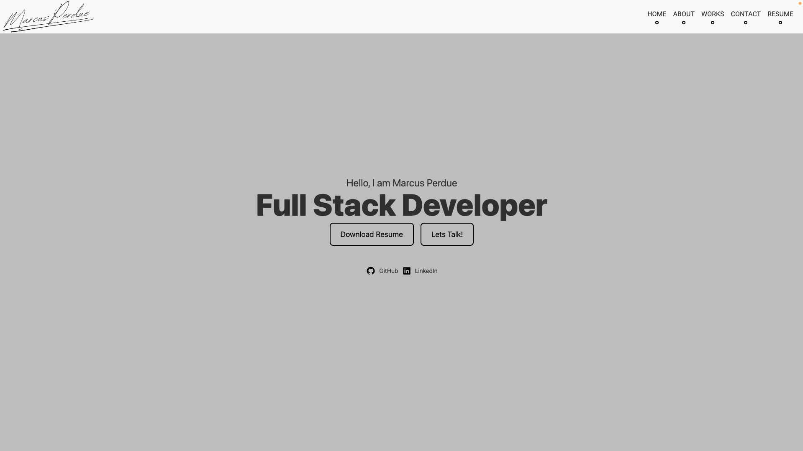

 

  

# React Portfolio

## Description
   React-based portfolio, showcasing my web development skills and projects. It is designed to provide a user-friendly experience for potential employers and collaborators.
 

 
## Deployment
The application is deployed on Netlify and can be accessed [here](https://ephemeral-rabanadas-49d0f6.netlify.app/).

## Table of Contents
- [Features](#features)
- [Technologies Used](#technologies-used)
- [Screenshots](#screenshots)
- [How to Run Locally](#how-to-run-locally)
- [Contributors](#contributors)
- [License](#license)

 
## Features
- Mobile-first design for a responsive layout.
- Unique color palette created using [Coolors](https://coolors.co/).
- React animations and transitions for improved user experience.
- Utilizes `react-router-dom` for seamless navigation between sections.

## Technologies Used
- React
- React Router
- HTML/CSS
- JavaScript
- Netlify for deployment

## Screenshots

## How to Run Locally
To run this project locally, follow these steps:

1. Clone this repository.
2. Navigate to the project directory.
3. Run `npm install` to install the dependencies.
4. Run `npm run dev` to start the development server.
5. Open your web browser and access `http://localhost:3000`.

 ## Contact

    
     
    <a href="https://github.com/marcusperdue">marcusperdue</a>

